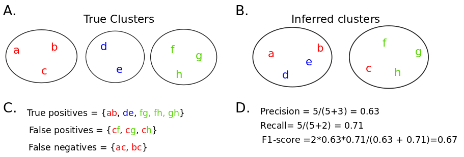

# F1-score Evaluation 

## Command-line
``` diff
$python  evaluateSimCluster.py -p <clustering output> -t <true cluster file>
```
where -p takes the formatted clustering output and -t takes the true clustes.

## Input Format
```
1 S22 S135 S136 S635
2 S180 S181 S431 S432 S433 S434 S435 S436 S437 S438 S439 S440
3 S542 S553
 ```
The first column indicates the cluster number, from second column Ids of sequences grouped into that cluster. The sequences Id's are seperated by space.

## Pairwise F1-score calculation
When B-cell clonal expansion is known we can assess the ability of the
clustering algorithms to identify clonally-related sequences belonging to the same
clone. In such a case we apply classical measures such as precision and
recall that compare the inferred clones to the real ones.  We can also
compute the F$_{1}$-score, the harmonic average of the precision and recall. 
However, these comparatives measures are only applicable to the simulated repertoires, since
we don't know the true clones or groups of clonally-related sequences in experimental data.

Precision and recall use three disjoint
categories which are: true positive (TP), false positive (FP) and false negative (FN).
%There are at least two ways to compute them: with a pairwise relationship or the closeness to the true clone. 
To compute them we have considered the binary clustering task, which evaluates the relationship between each pair of sequences. 
A pair of sequences $(i,j)$ is counted as: TP, if the sequences are found together in both 'true' and 'inferred' clones;
FP, if the sequences are found separated in the 'true' clone, but together in the 'inferred' one; 
FN, if the pair is found together in the 'true' clone but separated in the 'inferred' one, see an illustration in Sup Fig 1.

Once TP, FP and FN are computed, the precision $p$, also known as positive predictive value (PPV), is defined by $p = \frac{TP}{TP + FP}$, the recall $r$, or  sensitivity, is defined by $r = \frac{TP}{TP + FN}$, and the  F$_{1}$-score, that combines both precision and the recall, is defined by
$\textrm{F}_{1}\textrm{-score} = \frac{2*p*r}{p + r}$. The values of these three metrics are between 0 and 1, being 1 the best and
0 the worse performance.\\



